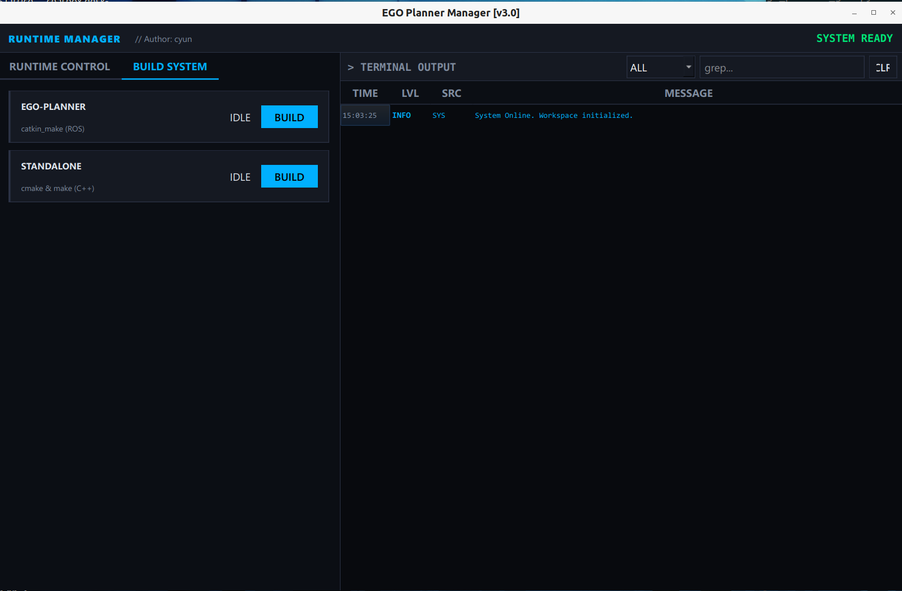
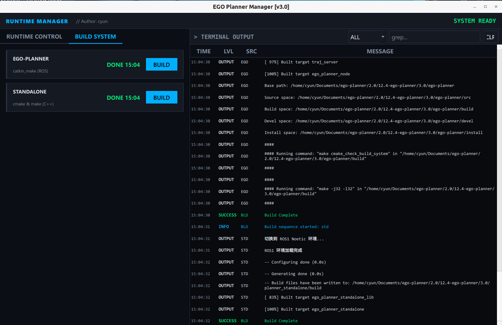
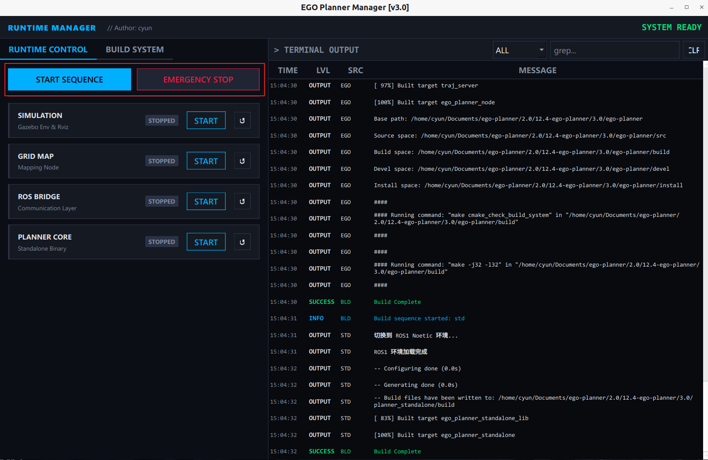

# ego_planner_standalone
本项目将原始的ROS EGO-Planner分离为两部分：
1. **ROS Bridge** (`ego-planner/src/ros_bridge`): 处理ROS消息和共享内存通信
2. **Planner Standalone** (`planner_standalone`): 无ROS依赖的纯C++规划算法

**视频演示，点击跳转**
[](https://www.bilibili.com/video/BV1ij27BtEzd/?vd_source=32148098d54c83926572ec0bab6a3b1d#reply115667395152781)

## 当前架构

### 数据流

```
仿真环境 (simulator)
    ↓
ROS话题订阅
    ↓
ROS Bridge Node
    ↓
共享内存 (Shared Memory)
    ↓
Planner Standalone (FSM + 算法)
    ↓
共享内存 (Shared Memory)
    ↓
ROS Bridge Node
    ↓
ROS话题发布 → Traj Server → 控制器
```

### 输入数据（从仿真环境）

1. **定位数据** (`/visual_slam/odom`)
   - 位置、速度、姿态
   - 频率: ~100Hz

2. **点云数据** (`/grid_map/occupancy_inflate`)
   - 已膨胀的障碍物点云
   - 频率: ~10Hz
   - **注意**: 仿真已完成膨胀，算法端不需要再处理

3. **目标航点** (`/waypoint_generator/waypoints`)
   - 目标位置
   - 事件驱动（用户在RViz中点击）

### 输出数据（给控制器）

1. **B样条轨迹** (`/planning/bspline`)
   - 控制点
   - 节点向量 (knots)
   - 轨迹ID
   - 发布给 `traj_server`

2. **轨迹可视化** (`/planning/bspline_path`)
   - Path消息格式
   - 用于RViz显示

3. **规划器状态** (`/planning/planner_state`)
   - FSM状态 (INIT, WAIT_TARGET, GEN_NEW_TRAJ, etc.)


## 使用方法
```bash
pip install pyside6
```


```bash
python application/ego_planner_gui.py
```


到build界面中,编译两个部分:



编译完成后,就可以直接启动了,其中前面两个大的是总的启动按钮,可以运行四个start



或者按照顺序启动下面的四个start即可.

对应的命令是:
```bash
cd ego-planner;source devel/setup.bash && roslaunch ego_planner_bridge sim_only.launch

cd ego-planner;source devel/setup.bash && roslaunch grid_map_standalone test_grid_map.launch

cd ego-planner;source devel/setup.bash && roslaunch ego_planner_bridge run_bridge.launch

cd planner_standalone/build;./ego_planner_standalone
```
